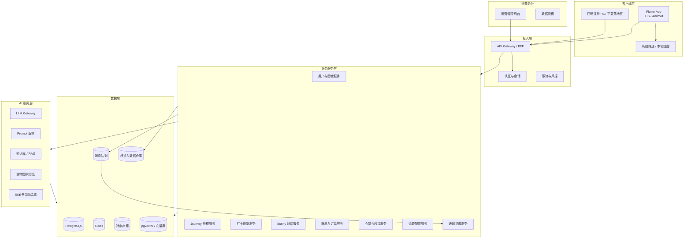
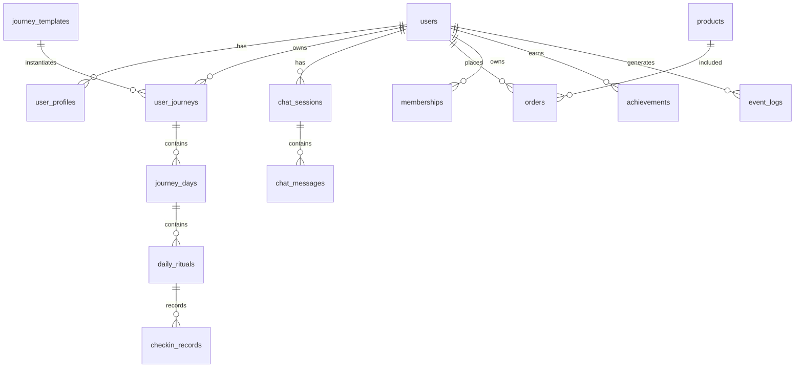
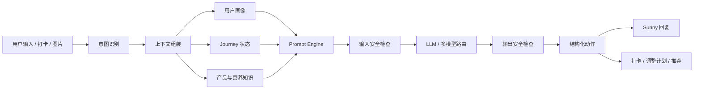
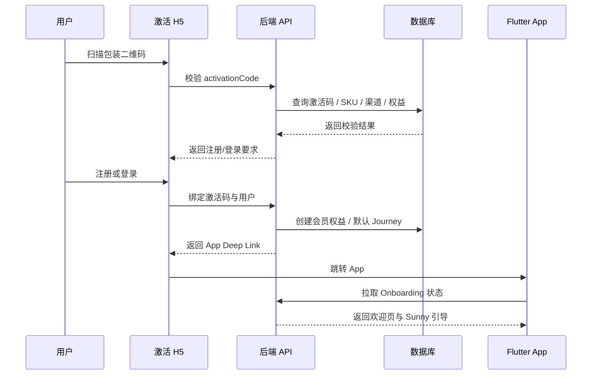
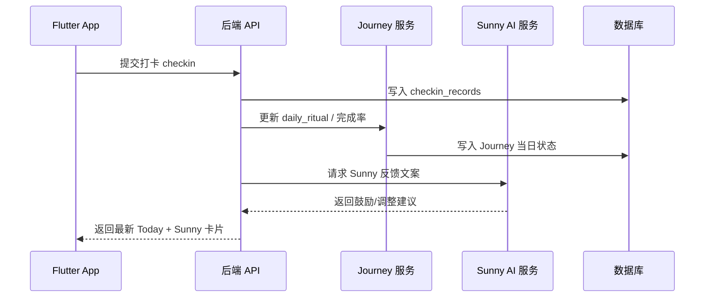

# ChatViva Slim 前后端技术框架文档

> 基于《ChatViva Slim 功能架构说明文档 V1.0》整理  
> 前端指定技术方向：Flutter  
> 适用范围：研发架构评审、模块拆解、接口设计、工程排期、后续详细设计

---

## 1. 项目背景与技术目标

### 1.1 产品定位摘要

ChatViva 是 Luckdate 品牌体系下的 AI 生命力陪伴系统。Slim Journey 是首期围绕代餐产品 Solar Protein 的 30/90 天减脂陪伴旅程。产品不是普通健康工具 App，而是通过 Sunny AI 伙伴完成陪伴、计划、记录、反馈、成长看板与复购承接。

核心体验包括：

- 产品扫码激活与权益绑定
- Sunny AI 陪伴与日常对话
- Today Ritual 每日仪式与快速打卡
- 30/90 天 Journey 旅程进度、阶段目标、徽章和生命力指数
- Collection 商品与 Journey Extension 推荐
- Profile 个人档案、会员、订单、设置
- 后台运营配置：旅程、话术、Prompt、商品、数据看板

### 1.2 技术建设目标

| 目标 | 说明 |
|---|---|
| 快速交付 MVP | 优先完成 30 天 Slim Journey 闭环，控制复杂度 |
| 多端一致体验 | Flutter 支持 iOS / Android，必要时扩展 Web / Pad |
| AI 能力可配置 | Sunny 人格、Prompt、话术、触发规则、知识库可运营配置 |
| 数据驱动迭代 | 支持打卡、留存、对话、复购、Journey Extension 等指标采集 |
| 商业闭环 | 商品、会员、订单、复购入口与旅程节点联动 |
| 可扩展 Journey | 后续可扩展 Youth、Femme、Sleep、Energy 等 Journey |
| 安全与合规 | 健康类数据、AI 建议、隐私授权、风控提示需要规范处理 |

---

## 2. 总体技术架构

### 2.1 推荐架构分层



### 2.2 MVP 推荐技术选型

| 层级 | 推荐技术 | 说明 |
|---|---|---|
| App 前端 | Flutter 3.x + Dart | 一套代码覆盖 iOS / Android，适合高一致性 UI 与动效 |
| 状态管理 | Riverpod 或 Bloc | 推荐 Riverpod，轻量、可测试、适合模块化；团队已有 Bloc 经验可选 Bloc |
| 路由 | go_router | 支持声明式路由、深链、登录守卫、Tab Shell |
| 网络 | Dio + Retrofit / Chopper | 拦截器、重试、超时、Token 刷新、结构化 API 调用 |
| 本地存储 | Hive / Isar + flutter_secure_storage | 轻量缓存、离线草稿、安全 Token 存储 |
| 后端 API | NestJS / Node.js TypeScript | 与前端 TypeScript 生态、AI 编排、BFF 开发效率匹配 |
| 数据库 | PostgreSQL | 用户、旅程、打卡、订单、配置等核心关系数据 |
| 缓存 | Redis | 会话、验证码、限流、热点配置、对话短期上下文 |
| 队列 | RabbitMQ / BullMQ / Kafka | 推送、报告生成、AI 异步任务、埋点异步写入 |
| AI 编排 | LLM Gateway + Prompt Engine + RAG | 统一模型调用、Prompt 版本管理、知识检索与安全过滤 |
| 向量存储 | pgvector / Milvus | MVP 推荐 pgvector，降低系统复杂度 |
| 对象存储 | S3 / COS / OSS | 食物图片、头像、报告图片、分享图、商品素材 |
| 管理后台 | React + Ant Design Pro | 运营配置、数据看板、用户管理、商品管理 |
| 监控 | OpenTelemetry + Prometheus/Grafana + Sentry | 链路、性能、错误、AI 调用成本监控 |

> 如果团队 Java 技术栈更强，后端也可替换为 Spring Boot 3 + PostgreSQL + Redis。本文后续以 NestJS 方案展开。

---

## 3. 前端 Flutter 技术框架

### 3.1 前端架构原则

1. **体验围绕 Journey 和 Sunny 组织**：Tab、页面、组件都服务于陪伴式旅程，而非工具列表。
2. **30 秒完成核心操作**：Today Ritual 的代餐、饮水、体重、心情记录必须极轻量。
3. **弱惩罚、强正反馈**：UI 状态避免“失败、断签、排名”，使用成长、点亮、完成感表达。
4. **模块化可扩展**：Slim Journey 是首个 Journey，代码层面要支持后续多 Journey 扩展。
5. **配置驱动**：话术、任务、徽章、阶段节点、推送策略尽量由后端配置下发。
6. **AI 体验可恢复**：Chat 对话、打卡状态、图片上传等需要处理网络异常、重试和草稿保留。

### 3.2 Flutter 推荐目录结构

```text
lib/
  main.dart
  app/
    app.dart
    router.dart
    theme/
    localization/
    env.dart
  core/
    network/
      dio_client.dart
      api_result.dart
      interceptors/
    storage/
      secure_storage.dart
      cache_store.dart
    errors/
    utils/
    widgets/
    analytics/
  features/
    auth/
      data/
      domain/
      presentation/
    onboarding/
    today/
    journey/
    chat/
    collection/
    profile/
    notification/
  shared/
    models/
    components/
    extensions/
```

### 3.3 前端分层模式

推荐采用 **Feature-first + Clean Architecture 简化版**：

```text
presentation  页面、组件、状态管理、交互逻辑
    ↓
domain        Entity、UseCase、Repository 抽象
    ↓
data          DTO、API Client、Repository 实现、本地缓存
```

| 层 | 职责 | 示例 |
|---|---|---|
| Presentation | UI、State、用户交互、页面导航 | TodayPage、ChatPage、JourneyDashboard |
| Domain | 业务用例与实体 | CompleteRitualUseCase、JourneyEntity |
| Data | 网络、缓存、DTO 转换 | JourneyApi、CheckinRepositoryImpl |
| Core | 跨模块能力 | 网络、存储、埋点、错误处理、主题、国际化 |

### 3.4 状态管理建议

推荐 **Riverpod 2.x**：

- `StateNotifier / AsyncNotifier` 管理页面状态
- `Provider` 管理 Repository、UseCase、配置
- `FutureProvider / StreamProvider` 处理异步数据和实时对话流
- 便于单元测试和模块拆分

典型状态拆分：

| 模块 | State | 说明 |
|---|---|---|
| Auth | AuthState | 登录态、Token、用户基本信息 |
| Onboarding | OnboardingState | 首次信息采集、目标设置、提醒时间 |
| Today | TodayRitualState | 当天任务、完成状态、Sunny 卡片、异常提示 |
| Journey | JourneyState | Day、阶段、进度、徽章、生命力指数 |
| Chat | ChatSessionState | 消息列表、输入状态、图片上传、AI 回复流 |
| Collection | ProductState | 商品列表、推荐、订单入口 |
| Profile | ProfileState | 用户档案、会员、设置、历史旅程 |

### 3.5 底部导航与路由

PRD 指定 5 大 Tab：

1. Home / Today
2. Journey
3. Chat
4. Collection
5. Profile

推荐使用 `go_router` 的 `StatefulShellRoute` 保持每个 Tab 独立导航栈。

```text
/app
  /today
  /journey
    /detail/:journeyId
    /report/:reportId
  /chat
    /session/:sessionId
  /collection
    /product/:productId
    /order/:orderId
  /profile
    /settings
    /membership
/onboarding
/auth
/h5-activation-redirect
```

路由守卫：

- 未登录：进入 Auth
- 已登录但未完成 Onboarding：进入 Onboarding
- 已激活 Journey：进入 Today
- 深链扫码：`chatviva://activate?code=xxx` 或 HTTPS App Link

### 3.6 核心页面模块设计

#### 3.6.1 Today Ritual

功能：

- 欢迎区：时间问候、昵称、Journey Day、品牌口号
- 当天 Ritual：代餐、体重、饮水、状态反馈
- Sunny 今日卡片：鼓励、提醒、异常关怀
- 生命力摘要：Energy Score、Ritual Completion、Consistency
- 异常提示：连续未打卡、饮水不足、体重波动等

前端实现要点：

- Ritual 卡片组件化：`RitualCard`、`HydrationStepper`、`WeightInputSheet`、`MoodSelector`
- 打卡接口要支持乐观更新，失败后可回滚
- 所有任务文案、排序、是否必填由后端配置
- Today 页面首屏数据建议聚合接口一次返回，减少冷启动请求

#### 3.6.2 Journey

功能：

- 30 天进度环、Solar Aura 点亮
- 阶段目标：启动期、适应期、稳定期、冲刺期
- Vitality Dashboard：Energy、Consistency、Hydration、Sleep、Mood、Ritual Completion
- 里程碑徽章：Day 7 / 14 / 21 / 28 / 30
- 30 天毕业仪式与报告

前端实现要点：

- 进度、徽章、阶段卡片做成可复用组件
- 对 30/90 天 Journey 使用同一套 Journey Template 渲染
- 报告页支持生成分享图，可用 `RepaintBoundary` 导出图片
- 不显示断签惩罚和排名，异常状态用温和表达

#### 3.6.3 Sunny Chat

功能：

- 日常陪伴对话
- 快捷打卡：代餐、饮水、运动、反思、体重
- 自然语言打卡理解
- 计划调整
- 食物拍照分析
- 情绪支持
- Journey Extension 隐性推荐

前端实现要点：

- 支持流式消息展示：SSE / WebSocket / HTTP Chunk
- 图片上传先走对象存储预签名 URL，再调用识别接口
- Chat 快捷按钮由后端按场景下发
- 支持消息状态：发送中、成功、失败、重试
- AI 回复需有安全兜底：健康风险提示、非医疗建议声明

#### 3.6.4 Collection

功能：

- 产品系列陈列：Solar Protein、Youth Solar、Sun Femme 等
- 产品详情：定位、阶段、用法、规格、价格、购买入口
- 阶段推荐：根据 Journey 方向推荐
- 购买、订单、会员权益
- 内容教育：科学、原料、搭配建议

前端实现要点：

- 商品卡片风格要“作品馆”，避免普通 SKU 列表感
- 商品与 Journey Extension 关联，支持从 Day 28 / Day 30 跳转
- 订单、支付、物流可先对接第三方商城或轻量内部订单系统

#### 3.6.5 Profile

功能：

- 用户资料、目标、语言、单位设置
- ChatViva Membership
- My Journey 当前与历史旅程
- Achievements 徽章、毕业证书、分享图
- Orders 订单、物流、售后
- Settings & Help 通知、隐私、客服、健康风险提示

### 3.7 前端本地存储策略

| 数据 | 存储位置 | 说明 |
|---|---|---|
| Access Token / Refresh Token | flutter_secure_storage | 安全存储 |
| 用户基础信息缓存 | Hive / Isar | 快速展示，需可过期 |
| Today 首屏缓存 | Hive / Isar | 弱网可展示最近状态 |
| Chat 消息缓存 | Isar 优先 | 消息列表分页、本地草稿 |
| 运营配置缓存 | Hive / Isar | Journey 模板、话术按钮、任务配置 |
| 图片临时文件 | App Cache | 上传后及时清理 |

### 3.8 前端网络与错误处理

- Dio 全局拦截器：Token 注入、请求 ID、语言、App 版本、设备信息
- Token 刷新：401 时单飞刷新，避免并发重复刷新
- 统一 API Result：成功、业务错误、网络错误、服务错误
- 弱网策略：Today / Journey 可展示缓存；Chat 发送失败支持重试
- 错误文案保持陪伴感，不使用冷冰冰提示

### 3.9 国际化与单位

PRD 面向全球年轻状态管理品牌，建议前期预留：

- Flutter `intl` / `flutter_localizations`
- 支持中文、英文文案资源
- 体重单位：kg / lb
- 身高单位：cm / ft/in
- 时间与推送按用户时区处理

---

## 4. 后端技术框架

### 4.1 后端服务边界

MVP 阶段建议采用 **模块化单体 + 清晰领域边界**，避免过早微服务化。业务增长后可逐步拆服务。

```text
backend/
  src/
    main.ts
    common/
      auth/
      guards/
      interceptors/
      filters/
      decorators/
    modules/
      user/
      auth/
      activation/
      onboarding/
      journey/
      ritual/
      checkin/
      chat/
      ai/
      product/
      order/
      membership/
      notification/
      config/
      analytics/
      admin/
```

### 4.2 领域模块说明

| 模块 | 职责 |
|---|---|
| Auth | 登录注册、Token、验证码、第三方登录 |
| Activation | 扫码激活、激活码校验、SKU 绑定、权益生成 |
| User | 用户资料、目标、偏好、健康风险提示授权 |
| Onboarding | 首次引导、基础信息采集、目标设置 |
| Journey | Journey 模板、用户旅程、阶段、Day 计划、里程碑 |
| Ritual / Checkin | 每日任务、代餐/饮水/体重/心情/睡眠等记录 |
| Chat | 会话、消息、AI 回复、快捷打卡、上下文管理 |
| AI | LLM 调用、Prompt 编排、RAG、食物识别、安全过滤 |
| Product | 商品、产品线、推荐、Journey Extension |
| Order | 订单、支付、物流、售后对接 |
| Membership | 会员、权益、有效期、续费入口 |
| Notification | 推送、提醒、触发规则、用户时区任务 |
| Config | 运营配置：话术、Prompt、Journey、徽章、推送策略 |
| Analytics | 埋点采集、漏斗、留存、转化指标 |
| Admin | 后台用户、权限、配置管理、数据看板 |

### 4.3 API 接入层设计

推荐：

- REST API 为主，便于 Flutter 快速接入
- Chat 流式回复使用 SSE 或 WebSocket
- 后台管理 API 与 App API 逻辑隔离
- API Gateway / BFF 做鉴权、限流、灰度、聚合接口

API 前缀建议：

```text
/api/v1/app/*      App 端 API
/api/v1/admin/*    运营后台 API
/api/v1/public/*   H5 激活、公开配置、下载页
/api/v1/webhook/*  支付、物流、第三方回调
```

### 4.4 数据库设计概要

核心实体关系：



#### 4.4.1 关键表建议

| 表 | 说明 |
|---|---|
| users | 登录账号、手机号/邮箱、状态、注册来源 |
| user_profiles | 年龄、身高、体重、目标、饮食习惯、运动习惯、语言、单位 |
| activation_codes | 激活码、SKU、渠道、权益、使用状态 |
| journey_templates | Journey 模板，如 Slim 30 天、Slim 90 天 |
| journey_template_days | 每天主题、任务、鼓励语、是否里程碑 |
| user_journeys | 用户当前旅程、起止日期、阶段、完成状态 |
| journey_days | 用户旅程每日实例，Day、日期、状态 |
| daily_rituals | 每日任务实例，代餐、饮水、体重、心情等 |
| checkin_records | 打卡记录，类型、数值、来源、时间 |
| vitality_scores | 生命力指数与分项指标快照 |
| achievements | 徽章、里程碑、毕业证书 |
| chat_sessions | 对话会话 |
| chat_messages | 用户消息、AI 消息、系统消息、引用数据 |
| ai_prompt_versions | Prompt 模板、版本、适用场景 |
| ai_knowledge_docs | 产品知识、营养知识、行为建议知识库 |
| products | 商品、产品线、价格、库存、详情 |
| product_recommendations | Journey Extension 推荐规则 |
| orders | 订单、支付、物流、售后状态 |
| memberships | 会员权益、有效期、来源 |
| notification_rules | 推送规则、触发条件、频率 |
| event_logs | 行为埋点原始日志 |
| operation_configs | 运营配置通用表 |

### 4.5 Journey 配置模型

Journey 不建议写死在 App 中，应由后端模板驱动。

```json
{
  "journeyCode": "slim_30",
  "name": "Slim Journey 30 Days",
  "phases": [
    { "name": "启动期", "startDay": 1, "endDay": 7 },
    { "name": "适应期", "startDay": 8, "endDay": 14 },
    { "name": "稳定期", "startDay": 15, "endDay": 21 },
    { "name": "冲刺期", "startDay": 22, "endDay": 30 }
  ],
  "days": [
    {
      "day": 1,
      "themeEn": "Action",
      "themeZh": "开始行动",
      "tasks": ["meal_replacement", "hydration", "weight", "mood"],
      "encouragement": "从今天开始，不追求完美，只完成第一步",
      "milestone": false
    }
  ]
}
```

### 4.6 AI / Sunny 服务架构

Sunny 是产品核心差异点，建议单独抽象 AI 服务层。



#### 4.6.1 Sunny 能力拆分

| 能力 | 技术实现 |
|---|---|
| 日常陪伴对话 | LLM + 用户画像 + Journey 上下文 |
| 快捷打卡理解 | 规则意图识别 + LLM 辅助解析 |
| 自然语言打卡 | NLU 抽取类型、数值、时间，写入 checkin_records |
| 计划调整 | 规则引擎 + LLM 文案生成 |
| 食物拍照分析 | 图片上传 + 视觉模型识别 + 营养估算 |
| 情绪支持 | 情绪分类 + 安全话术 + 降低目标建议 |
| 隐性推荐 | Journey 节点规则 + 商品推荐规则 + Sunny 话术 |

#### 4.6.2 Prompt 管理

Prompt 应支持后台配置和版本化：

- Sunny 人格主 Prompt
- 场景 Prompt：打卡成功、饮水不足、体重波动、情绪低落、里程碑、毕业仪式
- 商品推荐 Prompt
- 食物识别解释 Prompt
- 安全兜底 Prompt

Prompt 版本需要记录：

- `prompt_key`
- `version`
- `language`
- `scenario`
- `content`
- `status`
- `created_by`
- `published_at`

#### 4.6.3 AI 安全边界

由于涉及减脂、体重、饮食、睡眠和情绪，需明确：

- Sunny 不做医疗诊断
- 不承诺具体减重效果
- 对极端节食、疑似进食障碍、严重情绪危机要触发风险提示
- 对孕期、慢病、药物、过敏、禁忌等场景建议咨询专业人士
- 所有健康建议保持温和、低风险、可执行

---

## 5. 后台与运营配置架构

### 5.1 后台功能模块

| 模块 | 功能 |
|---|---|
| 用户管理 | 用户列表、用户详情、旅程状态、标签、风险标记 |
| Journey 管理 | Journey 模板、阶段、Day 任务、鼓励语、里程碑 |
| Ritual 配置 | 任务类型、完成条件、排序、默认提醒 |
| Sunny 话术库 | 按场景配置固定话术、快捷回复、兜底文案 |
| Prompt 配置 | Prompt 版本、灰度、发布、回滚 |
| 商品管理 | 产品线、SKU、价格、库存、详情、素材 |
| 推荐规则 | Journey Extension、节点触发、推荐商品 |
| 推送策略 | 触发时间、频率、时区、模板、开关 |
| 数据看板 | 激活率、留存率、打卡完成率、对话次数、复购率 |
| 权限管理 | 角色、菜单、操作日志 |

### 5.2 配置发布机制

建议配置使用“草稿 - 预览 - 发布 - 回滚”机制：

```text
Draft -> Review/Preview -> Published -> Archived/Rollback
```

关键配置发布后需要写入 Redis 热缓存，App 通过版本号增量拉取。

---

## 6. 核心业务流程技术拆解

### 6.1 扫码激活流程



### 6.2 首次 Onboarding 流程

1. 登录/注册完成
2. Sunny 欢迎页建立陪伴关系
3. 收集基础资料：年龄、身高、当前体重、目标体重
4. 收集习惯：饮食、运动、睡眠、压力、禁忌或风险
5. 选择产品使用节奏和提醒时间
6. 后端生成用户 Slim Journey
7. App 进入 Today Day 1

### 6.3 每日打卡流程



### 6.4 Chat 自然语言打卡流程

1. 用户输入：“今天喝完代餐了，也喝了 6 杯水”
2. Chat 服务识别意图：代餐打卡、饮水记录
3. LLM / 规则引擎抽取结构化数据
4. 写入 checkin_records
5. 更新 Today Ritual 与 Journey 完成率
6. Sunny 生成温柔反馈
7. App 消息流展示，同时 Today 页面状态同步

### 6.5 30 天毕业与复购承接

1. Day 28 触发下阶段方向选择与复购埋点
2. Day 29 邀请用户准备毕业仪式
3. Day 30 自动生成 30 天生命力报告
4. 发放完成徽章和毕业祝福
5. 根据用户选择推荐 Journey Extension
6. 跳转 Collection 对应产品或下一旅程

---

## 7. API 设计草案

### 7.1 App 聚合接口

| 接口 | 方法 | 说明 |
|---|---|---|
| `/api/v1/app/bootstrap` | GET | App 启动信息、用户态、配置版本 |
| `/api/v1/app/today` | GET | Today 首屏聚合数据 |
| `/api/v1/app/journey/current` | GET | 当前 Journey 状态 |
| `/api/v1/app/chat/session` | GET/POST | 获取或创建 Chat 会话 |
| `/api/v1/app/collection/recommendations` | GET | 当前用户商品/旅程推荐 |

### 7.2 Auth / Activation

| 接口 | 方法 | 说明 |
|---|---|---|
| `/api/v1/public/activation/verify` | POST | 校验激活码 |
| `/api/v1/app/auth/login` | POST | 登录 |
| `/api/v1/app/auth/register` | POST | 注册 |
| `/api/v1/app/auth/refresh` | POST | 刷新 Token |
| `/api/v1/app/activation/bind` | POST | 绑定激活码 |

### 7.3 Onboarding / User

| 接口 | 方法 | 说明 |
|---|---|---|
| `/api/v1/app/onboarding/status` | GET | 首次引导状态 |
| `/api/v1/app/onboarding/submit` | POST | 提交基础资料与目标 |
| `/api/v1/app/user/profile` | GET/PUT | 用户资料 |
| `/api/v1/app/user/preferences` | GET/PUT | 语言、单位、提醒偏好 |

### 7.4 Ritual / Checkin

| 接口 | 方法 | 说明 |
|---|---|---|
| `/api/v1/app/rituals/today` | GET | 当天任务列表 |
| `/api/v1/app/checkins` | POST | 提交打卡 |
| `/api/v1/app/checkins/:id` | PUT | 修改打卡 |
| `/api/v1/app/checkins/history` | GET | 历史记录 |

### 7.5 Chat / AI

| 接口 | 方法 | 说明 |
|---|---|---|
| `/api/v1/app/chat/messages` | GET | 消息分页 |
| `/api/v1/app/chat/messages` | POST | 发送消息 |
| `/api/v1/app/chat/stream` | SSE | 流式 AI 回复 |
| `/api/v1/app/chat/quick-actions` | GET | 快捷按钮 |
| `/api/v1/app/ai/food-image/analyze` | POST | 食物图片分析 |

### 7.6 Product / Order / Membership

| 接口 | 方法 | 说明 |
|---|---|---|
| `/api/v1/app/products` | GET | 商品列表 |
| `/api/v1/app/products/:id` | GET | 商品详情 |
| `/api/v1/app/orders` | GET/POST | 订单列表与创建 |
| `/api/v1/app/membership` | GET | 会员权益 |

---

## 8. 数据指标与埋点框架

### 8.1 核心指标

| 类别 | 指标 | 说明 |
|---|---|---|
| 用户数据 | 激活率 | 扫码激活 / 产品售出 |
| 用户数据 | 7 日留存率 | 首日后第 7 天回访 |
| 用户数据 | 30 日留存率 | 首日后第 30 天回访 |
| 行为数据 | 打卡完成率 | 实际打卡 / 计划打卡 |
| 行为数据 | Sunny 对话次数 | 每日 / 每周 / 每月 |
| 健康行为数据 | 用户主动记录次数 | 体重、饮水、心情、睡眠等 |
| 商业数据 | 复购率 | 购买后 60 天复购比例 |
| 商业数据 | Journey Extension 转化率 | 30 天后选择新旅程比例 |

### 8.2 前端埋点事件建议

| 事件 | 触发时机 |
|---|---|
| `app_open` | App 启动 |
| `activation_scan_open` | 扫码落地页打开 |
| `activation_bind_success` | 激活绑定成功 |
| `onboarding_start` / `onboarding_complete` | 首次引导开始/完成 |
| `today_view` | 进入 Today |
| `ritual_complete` | 完成每日任务 |
| `chat_message_send` | 发送 Chat 消息 |
| `chat_ai_response_view` | 查看 Sunny 回复 |
| `journey_view` | 查看 Journey |
| `milestone_unlock` | 解锁里程碑 |
| `day30_report_view` | 查看 30 天报告 |
| `extension_direction_select` | 选择下一阶段方向 |
| `product_view` | 查看商品详情 |
| `order_create` | 创建订单 |

### 8.3 埋点技术实现

- App 端本地队列缓存，批量上报
- 网络失败时延迟重试
- 事件统一包含：userId、anonymousId、sessionId、journeyId、day、appVersion、platform、timezone
- 后端异步写入数据仓库，避免影响主流程性能

---

## 9. 安全、隐私与合规

### 9.1 数据安全

- Token 使用短期 Access Token + 长期 Refresh Token
- Refresh Token 存储在安全存储中
- 敏感健康数据传输全程 HTTPS
- 后端数据库字段按需加密，如健康风险、禁忌、体重记录
- 对象存储使用私有 Bucket + 预签名 URL
- 管理后台需 RBAC 权限与操作日志

### 9.2 隐私授权

首次 Onboarding 建议明确展示：

- 收集哪些数据：身高、体重、目标、饮食、睡眠、心情等
- 数据用途：生成 Journey、个性化提醒、AI 陪伴建议
- 用户可删除或导出个人数据
- 食物图片上传前提示用途和保存策略

### 9.3 健康风险提示

Sunny 和页面文案需避免：

- 医疗诊断
- 绝对化承诺
- 极端减重建议
- 诱导过度节食

对高风险输入触发兜底：

- 严重低热量饮食
- 疑似进食障碍
- 极端焦虑或自责
- 孕期、慢病、药物、过敏等特殊情况

---

## 10. DevOps 与工程化

### 10.1 代码仓库建议

可采用 Monorepo 或多仓库。MVP 推荐 Monorepo，方便协作：

```text
chatviva/
  apps/
    mobile_flutter/
    admin_web/
    activation_h5/
  services/
    api_server/
    ai_worker/
  packages/
    api_contracts/
    shared_types/
    design_tokens/
  docs/
```

### 10.2 环境划分

| 环境 | 用途 |
|---|---|
| local | 本地开发 |
| dev | 联调环境 |
| staging | 预发布 / 验收 |
| production | 正式环境 |

### 10.3 CI/CD

Flutter：

- 静态检查：`flutter analyze`
- 单元测试：`flutter test`
- 构建：iOS / Android 自动打包
- 分发：TestFlight / Firebase App Distribution / 蒲公英等

后端：

- ESLint / Prettier
- 单元测试 / 集成测试
- 数据库 Migration 检查
- Docker 镜像构建
- 自动部署到 dev / staging

### 10.4 可观测性

| 类型 | 工具 | 关注点 |
|---|---|---|
| App 崩溃 | Sentry / Firebase Crashlytics | 崩溃率、设备、版本 |
| 后端链路 | OpenTelemetry | 请求耗时、错误、依赖调用 |
| 系统监控 | Prometheus + Grafana | CPU、内存、DB、Redis、队列 |
| 日志 | ELK / Loki | 业务日志、错误日志、AI 调用日志 |
| AI 成本 | 自建统计 | Token、模型、场景、耗时、失败率 |

---

## 11. MVP 研发拆解建议

### 11.1 第一阶段：基础闭环

目标：用户能从扫码激活进入 App，完成 Onboarding，开启 30 天 Journey。

- Auth / 注册登录
- 激活码校验与权益绑定
- Onboarding 信息采集
- Journey 模板与用户 Journey 生成
- Today Day 1 首屏

### 11.2 第二阶段：每日仪式与 Journey 看板

目标：完成 30 天打卡、阶段进度、徽章和生命力指数。

- Today Ritual：代餐、饮水、体重、心情
- Journey 进度环和阶段目标
- Day 7 / 14 / 21 / 28 / 30 里程碑
- 生命力指数计算
- 本地提醒与推送

### 11.3 第三阶段：Sunny Chat MVP

目标：Sunny 可以完成基础陪伴、打卡反馈和计划微调。

- Chat 会话与消息
- 快捷打卡
- Sunny 场景话术
- LLM 基础对话
- Prompt 配置后台
- 安全兜底

### 11.4 第四阶段：Collection 与商业闭环

目标：承接复购和 Journey Extension。

- 商品列表与详情
- 推荐规则
- 订单入口
- 会员权益
- Day 28 / Day 30 推荐路径

### 11.5 第五阶段：运营后台与数据看板

目标：运营可配置内容、查看指标、调整策略。

- 用户管理
- Journey 配置
- Sunny 话术和 Prompt 配置
- 商品配置
- 数据看板
- 埋点漏斗

---

## 12. 关键技术风险与建议

| 风险 | 表现 | 建议 |
|---|---|---|
| AI 回复不稳定 | Sunny 风格漂移、建议不一致 | Prompt 版本化、场景模板、输出安全过滤 |
| Journey 配置写死 | 后续扩展 Youth/Femme 成本高 | 后端 Journey Template 配置驱动 |
| 健康建议合规风险 | AI 可能给出医疗化建议 | 风险关键词、拒答策略、专业提示 |
| Flutter 首屏慢 | 首屏接口过多、资源过大 | Today 聚合接口、缓存、图片压缩 |
| Chat 与打卡状态不同步 | 自然语言打卡后 Today 未更新 | Chat Action 结构化返回，同步刷新 Today Provider |
| 埋点缺失 | 无法验证留存与复购 | MVP 初期即建立事件字典和埋点校验 |
| 后台配置误发布 | 影响线上 Journey | 草稿/预览/发布/回滚机制 |

---

## 13. 推荐落地结论

1. **前端采用 Flutter + Riverpod + go_router + Dio + Isar/Hive**，按 Feature-first 方式组织 Today、Journey、Chat、Collection、Profile 五大模块。
2. **后端采用 NestJS 模块化单体起步**，通过清晰领域模块承接用户、Journey、打卡、AI、商品、订单、会员、通知和配置。
3. **Journey、Ritual、Sunny 话术、Prompt、推送策略全部配置化**，避免 MVP 后期返工。
4. **Sunny AI 层单独抽象 LLM Gateway + Prompt Engine + RAG + Safety**，确保人格一致、成本可控、风险可控。
5. **数据体系从第一版就接入**，重点跟踪激活率、7/30 日留存、打卡完成率、Sunny 对话次数、复购率和 Journey Extension 转化。
6. **MVP 优先做完整闭环而不是堆功能**：扫码激活 → Onboarding → Today Ritual → Journey 成长反馈 → Sunny 陪伴 → Day 30 报告 → Collection 复购承接。
